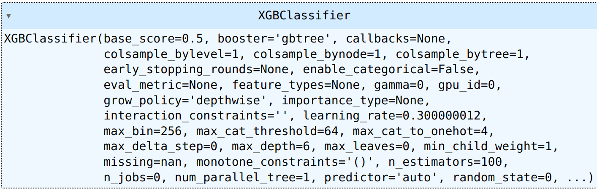
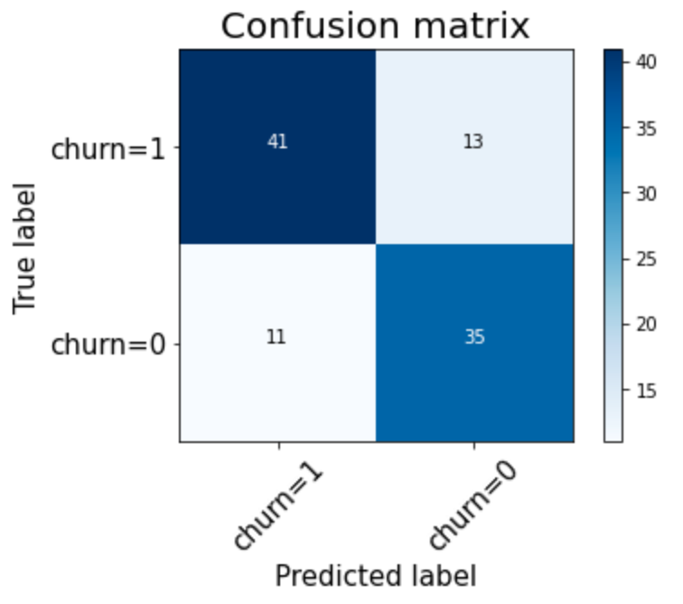
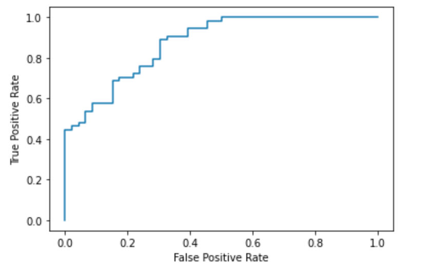

# Heart attack diagnosis

# Abstract
In the medical health panorama is known the importance of prevention.
Heart attack is one of the most common illnesses for people over 60 and it is very time critical.Indeed when a heart attack is early diagnosed it is easily curable instead when it is not diagnosed it can develop worse conditions such as brain damage. 

In this study I trained an XGBoost model that can predict the presence of a heart disease, by watching some patient’s blood values and medical records. The results are very promising since the classification accuracy is up to 90%.

# Introduction
The health field is filled with uncertainty due to the great amount of variables to consider in order to make a good diagnosis. 
It’s easy to find medical papers that use statistics to understand the comorbidities produced by a specific symptom or to prove the effectiveness of a clinical study.
Here is where the field of machine learning comes in, since it’s able to correlate high dimensional data just by watching a number (great enough) of samples. An example of this trend is the vast amount of studies made on covid-19 using machine learning and deep learning.
Those works showed very useful and promising results, however it is important to point out that the great amount of data used during the pandemic period is a result of a common effort to solve a global issue, but it’s a rare situation.
Often medical research is performed with a very low amount of data that makes it very hard for this instrument to produce reliable results.

In this work I will verify whether it is possible to classify clinical data to check the risk of occurrence of heart attack, with a low amount of data.

In the following chapter I will test the gradient boosting approach.

# Methods

## Dataset
This data set dates from 1988 and consists of four databases: Cleveland, Hungary, Switzerland, and Long Beach V. 
It contains 300 samples and 76 attributes, including the predicted attribute, but all published experiments refer to using a subset of 14 of them. 
The "output" field refers to the predisposition of the patient to get a heart attack. It is integer valued 0 = no disease and 1 = disease.

The attributes are:

+ __Age__ : Age of the patient 
+ __Sex__ :Sex of the patient 
+ __exang__:exercise induced angina (1 = yes; 0 = no) 
+ __ca__:number of major vessels (0-3) 
+ __cp__ :Chest Pain type chest pain type 
+ __Value 1__:typical angina 
+ __Value 2__:atypical angina 
+ __Value 3__:non-anginal pain 
+ __Value 4__:asymptomatic 
+ __trestbps__ :resting blood pressure (in mm Hg) 
+ __chol__ :cholestoral in mg/dl fetched via BMI sensor 
+ __fbs__ :(fasting blood sugar > 120 mg/dl) (1 = true; 0 = false) 
+ __restecg__ :resting electrocardiographic results 
+ __Value 0__:normal 
+ __Value 1__:having ST-T wave abnormality (T wave inversions and/or ST elevation or depression of > 0.05 mV) 
+ __Value 2__:showing probable or definite left ventricular hypertrophy by Estes' criteria 
+ __thalach__ :maximum heart rate achieved 
+ __oldpeak__ :ST depression induced by exercise relative to rest 
+ __slope__ :the slope of the peak exercise ST segment 
+ __thal__ :1 = normal; 2 = fixed defect; 3 = reversable defect 
+ __target__ :0= less chance of heart attack 1= more chance of heart attack 

The dataset informations extracted by pandas are

        <class 'pandas.core.frame.DataFrame'>
        RangeIndex: 303 entries, 0 to 302
        Data columns (total 14 columns):
        #   Column    Non-Null Count  Dtype  
        ---  ------    --------------  -----  
        0   age       303 non-null    int64  
        1   sex       303 non-null    int64  
        2   cp        303 non-null    int64  
        3   trestbps  303 non-null    int64  
        4   chol      303 non-null    int64  
        5   fbs       303 non-null    int64  
        6   restecg   303 non-null    int64  
        7   thalach   303 non-null    int64  
        8   exang     303 non-null    int64  
        9   oldpeak   303 non-null    float64
        10  slope     303 non-null    int64  
        11  ca        303 non-null    int64  
        12  thal      303 non-null    int64  
        13  target    303 non-null    int64  
        dtypes: float64(1), int64(13)
        memory usage: 33.3 KB

This dataset was taken by Kaggle at the following address: <a href="https://www.kaggle.com/datasets/johnsmith88/heart-disease-dataset">https://www.kaggle.com/datasets/johnsmith88/heart-disease-dataset</a>

## Data Preprocessing
Since I'm using a structured dataset it requires a feature wise normalization. To perform such action i used the StandardScaler.

## Model
Since the amount of data is too low for common deep learning models, I decided to switch to a more traditional machine learning tool that can handle smaller datasets like gradient boosting. 

# Results

 
ROC AUC score is  
0.8735909822866345

